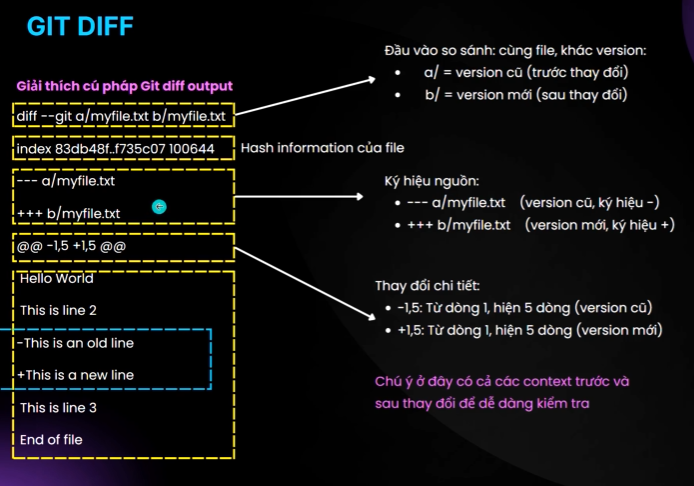

Created: 202508311300

Tags: 

## Cách cài đặt SSH key
```
ssh-keygen -t ed25519 -C "example@email.com"
```
- KO PUBLIC KEY

## Git commands
### `git add` : staging your changes
- di chuyển files từ working area -> staging area
- chuẩn bị collection thay đổi trước khi commit
- lệnh cơ bản
	- `git add filename.txt` : add 1 file cụ thể
	- `git add .` : add tất cả file đã thay đổi
	- `git add src/` : add toàn bộ folder


### `git commit`
- chuyển tất cả thay đổi từ staging area -> local repository
- lệnh: `git commit -m "message"`

- Conventional commits
	```
	<type>[optional scope]: <description>
	[optional body]
	[optional footer(s)]
	```
	- https://www.youtube.com/watch?v=OJqUWvmf4gg
	- https://viblo.asia/p/ban-dang-viet-commit-message-nhu-the-nao-gDVK22A0KLj
	- `type`: từ khóa để phân loại commit
		- `feat`:  introduces a new feature, tính năng mới
		- `fix`: fix bug
		- `docs`: cập nhật documents
		- `style:` : thêm khoảng trắng, format code, thiếu chấm phảy...
		- `refactor:`cải tiến code mà không thay đổi chức năng.
		- `test:` thêm test case, sửa unit test, refactor test.
		- `chore:` nhiệm vụ bảo trì (cập nhật file build, v.v.).
		- `build:` thay đổi ảnh hưởng đến quá trình build
		-  `ci:` thay đổi file cấu hình hoặc script CI
		- `perf:` cải tiến hiệu năng
		- `vendor`: cập nhật version cho các dependencies, packages.
	- `scope`: phạm vi ảnh hưởng mã nguồn
	- `description`: là mô tả ngắn gọn commit
		- không dài quá 50 ký tự
		- sử dụng câu mệnh lệnh thì hiện tại
	- `body`:
		- mô tả chi tiết hơn về commit nếu cần
		- cách phần `<type>: <description>` ở bên trên bởi 1 dòng trắng (blank line)
		- Nên dùng để giải thích câu hỏi **What**, hoặc **Why, chứ KHÔNG PHẢI How**
	- `footer`: một số thông tin mở rộng như số ID của pull request, issue.. được quy định theo conventional.
### `git log` - view commit history
- xem toàn bộ lịch sử commits của prj
- kiểm tra ai đã làm gì, khi nào
- tìm kiếm commit cụ thể hoặc những thay đổi quan trọng
- lệnh
	- `git log` : xem toàn bộ lịch sử
	- `git log --oneline` : hiển thị gọn - 1 dòng / commit
	- `git log -2` : xem 2 commits gần nhất 
	- `git log --author="thou05"` : xem commits của ng cụ thể
	- `git log --oneline --graph`: log mà có graph

### `git remote`
- kết nối giữa local repo và remote repo
- `git remote -v` : kiểm tra kết nối
	- TH1: chưa có remote (repo tạo bằng git init) ko hiển thị gì
	- TH2: đã có remote (clone từ github)
		- `origin https://github.com/user/repo.git (fetch)`
		-  `origin https://github.com/user/repo.git (push)`
			- `origin`: tên remote (convention)
			- `fetch`: url để tải code về
			- `push`: url để đẩy code lên

- `git remote add <name> <url>` : thêm kết nối với remote
	- tên remote thường để `origin`
- ít dùng
	- `git remote rename <old_name> <new_name>` : thay đổi tên remote
	- `git remote remove remote_name`: xóa remote

### `git push`


- đưa các commit từ local repo lên remote repo
- ngoài ra
	- chia sẻ code với ng khác
	- triển khai CI/CD
	- backup lưu trữ bản sao trên server
- ⚠️ git push chỉ đẩy những gì đã commit

- `git push -u origin main` : lần đầu push (đang đứng ở branch main)
	- mục đích
		- upload tất cả commit từ local
		- thiết lập tracking relationship
	- explain
		- `git push`: đẩy commits lên remote
		- `-u` : `--set-upsteam` thiết lập tracking
		- `origin`: tên remote
		- `main`: tên branch 
	- khi push lần đầu, git có thể yêu cầu xác thực, 2 cách thường dùng
		- ssh token : clone theo kiểu ssh
			- private key nằm ở local
			- public key lưu trong github account của mình
			- khi push, ssh private key được dùng để ký xác nhận -> nếu khớp public key thì nó biết là mình push (nếu ko ai cũng push đc)
		- personal access token : https
			- push có thể cần username (github account) và password (truyền token)
		- ⚠️: ko đc config email trong commit -> để github xác định ai push
- `git push`: lần tiếp theo 
	- do đã thiết lập upsteam tracking như câu lệnh bên trên với option `-u`

- ⚠️ Tên branch ở local và remote liên kết với nhau nên trùng tên cho dễ quản lý

### `git pull` và `git fetch`


- git pull = git fetch + git merge

- `git fetch`
	- Tải những thay đổi từ remote repo về
	- KHÔNG update vào working directory
	- mở file sẽ ko thấy khác biệt gì
	- cho phép xem trước khi merge
	- sử dụng khi muốn biết remote có gì thay đổi và cần xem trước

- `git pull`
	- thực hiện update trực tiếp vào working directory
	- merge luôn vào nhánh hiện tại
	- thay đổi ngay lập tức có thể thấy trong files
	- `git pull` : pull từ remote hiện tại (ở đây đã set up remote connection)
	- `git pull [remote] [branch]` : pull từ remote và branch cụ thể
		- vd: đang ở nhanh dev local nưng pull từ main về: `git pull origin main`
	- thường dduojc dùng khi làm việc 1 mình và trên 1 branch như main/master

## Collaboration
- `branch` 
	- branch : là 1 cách để phát triển tính năng mới, sửa lỗi... mà ko ảnh hưởng đến code đang chạy 
	- mỗi ng nên làm việc trên branch riêng để tránh xung đột và dễ quản lý công việc

- `git branch`
	- khi thực hiện commits, mỗi commit sẽ có kết nối với parent commit
	- tạo thành 1 chuỗi liên kết các commit theo thời gian
	- khi tạo branch mới
		- dựa trên branch hiện có (snapshot lại từ thời điểm tạo)
		- sau khi hoàn thành có thể merge lại
	- `git branch <new-branch-name>`: tạo branch mới
		- tạo nhánh mới từ nhánh hiện tại đang đứng
		- branch mơi ssex có cùng commit với nhánh hiện tại
		- không tự động chuyển sang nhánh mới
	- `git switch <branch-name>` : chuyển sang branch khác
		- chuyển sang làm việc với branch chỉ định
		- HEAD sẽ di chuyển theo
		- nên dùng switch thay vì checkout, checkout có rất nhiều chức năng - dễ nhầm
		- với lệnh trên branch muốn chuyển cần tồn tại rồi
	- `git switch -c <branch-name>` : vừa tạo branch mới vừa chuyển sang
	- `git branch`: kiểm tra branches
		- hiển thị tất cả các branch trong repo
		- banch hiện tại được đánh dấu bằng `*`
	- Xóa branch: cần chuyển sang nhasnhkhasc trước khi muốn xóa nhánh hiện tại
		- `git branch -d <branch-name>`: nhánh đã được merge vào nhánh khác rồi
		- `git branch -D <brach-name>` : nhánh chưa được merge vào nhánh khác (ép buộc xóa)

- `git checkout`: làm việc với các branch, commit và file
	- `git checkout <branch-name>`: chuyển branch
	- `git checkout <commit -hash>`: chuyển đến commit
	- `git checkout <file-name>` : phục hồi file

- `git head`
	- `HEAD` là 1 pointer đặc biệt trong git, hoạt động như 1 `bookmark` chi biết
		- vị trí hiện tại trong git repo
		- commit nào đang thấy trong working directory
		- branch đang làm việc
	- có thể kiểm tra khi chạy: `git log`
	- các trạng thái của HEAD
		- Normal HEAD (Attached HEAD)
			- HEAD đang `attached` với 1 branch
			- khi commit mới, branch sẽ di chuyển cùng HEAD
			- trạng thái bình thường khi làm việc
		- Detached HEAD
			- HEAD đang trỏ trực tiếp đến 1 commit cụ thể
			- không gắn với branch nào
			- commits mới có thể bị MẤT nếu ko tạo branch
	- di chuyển HEAD
		- chuyển branch (HEAD di chuyển theo)
			- `git checkout main`
			- `git switch feature`
		- chuyển đến commit cụ thể
			- `git checkout abc1234` : detached HEAD tại commit abc1234
			- `git checkout HEAD~2`: di chuyển về 2 commit trước đó
	- xử lý detached HEAD: tạo branch mới từ commit
		- `git checkout <commit_hash>`
		- `git branch <new_branch>`
		- `git switch <new_branch>`
		- OR `git switch -c <new_branch>` : gộp branch + switch vừa tạo vừa đổi

### `merge branch`
- hợp nhất các thay đổi từ branch này vào branch khác
- khi nào cần merge
	- feature đã hoàn thành
	- code đã đc test kỹ lưỡng
	- sẵn sàng đưa vào production
- cách thực hiện
	- chuyển về nhánh mà cta muốn merge nhánh khác vào
	- `git merge <branch-name>`
	- vd: muốn merge nhánh dev vào main
		- đứng ở nhánh main
		- `git merge dev`
- `fast-forward merge`
	- 
	- nhánh ban đầu ko có commit mới từ khi tạo branch mới từ nhánh ban đầu
	- branch mới phát triển tuyến tính từ nhánh ban đầu
	- đặc điểm
		- ko tạo commit mới
		- HEAD của master chỉ di chuyển đến vị trí cuối của branch
		- lịch sử commit tuyến tính

- `Three-way merge`
	- 

	- nhánh ban đầu có commits mới từ khi tạo new-branch
	- đặc điểm
		- tạo commit mới (merge commit)
		- merge commmit có 2 parents
		- giữ nguyên lịch sử của cả 2 branch
	- 2 trường hợp
		- KHÔNG có conflict
			- các branches thay đổi khác file
			- hoặc thay đổi khác vùng trong cùng file
			- git có thể tự động merge
		- CÓ conflict
			- cùng file, cùng dòng được thay đổi khác nhau
			- git ko biết nên giữ thay đổi nào
			- git sẽ
				- dừng merge và báo conflict
				- đánh dấu các files có conflict
				- chờ user resolve conflict
			```
			<<<<<<< HEAD
				nội dung bị conflict của nhánh hiện tại
				...
			=======
				nội dung bị conflict của nhánh được merge
			>>>>>>> new-feature
			```

### `git diff`
- chức năng chính
	- hiển thị sự khác biệt giữa các phiên bản của files
	- so sánh thay đổi ở các trạng thái khác nhau trong git
	- tương tự lệnh diff trong linux để so sánh 2 files
- một số loại so sánh
	- working directory vs last commit
	- staged changes vs last commit
	- branch và branch
	- commit và commit

- basic
	- `git diff`
		- so sánh current version của file (working directory) với last commit (HEAD)
		- chỉ hiển thị thay đổi chưa được staged (chưa git add)
		- nếu muốn chỉ so sánh 1 file: `git diff file_name`
	- `git diff --staged`
		- so sánh sau khi git add với commit cuối cùng
		- xem những gì sẽ được commit
- advance
	- `git diff <commit_1> <commit_2>` : so sánh giữa 2 commit
		- `git diff abc1234 def5678`
		- `git diff  <commit_1> <commit_2> --<filename>`: so sánh duy nhất 2 file giữa 2 commit
	- `git diff <branch1> <branch2>` : so sánh 2 branch
		- `git diff main feature-branch`
		- `git diff <branch1> <branch2> --<filename>` :  so sánh duy nhất 2 file giữa 2 branch
- best practices
	- luôn review với `git diff` trước khi commit
	- sử dụng `--staged` để xem chính xác những gì sẽ commit
	- so sánh branches trc khi merge
	- kết hợp `git status` để hiểu đầy đủ trạng thái
- dấu `--` giúp git phân biệt rõ ràng giữa branch/commit names và file paths, đặc biệt quan trọng khi tên file trùng với tên branch



## Going back and undoing changes
- khi nào cần going back
	- commit nhầm code
	- muốn xem code ở phiên bản cũ
	- cần toàn tác những thay đổi
- 4 lệnh chính để back
	- `git checkout` : chuyển đến commit cụ thể (detached head)
	- `git reset`: reset về commit trước đó
	- `git restore`: khôi phục file về trạng thái cũ
	- `git revert`: tạo commit mới để hoàn tác

### `git restore`
- đưa working directory về commit cuối cùng 1 cách nhanh chóng
- tình huống thường gặp
	- đã commit code hoàn chỉnh
	- thực hiên nhiều thay đổi trên files
	- gặp bug ko fix đc
	- muốn quay lại commit cuối cùng
	- ctrl z quá lâu và ko hiệu quả
- command
	- `git restore filename`
		- khô phục file trong working directory về trạng thái commit cuối cùng
	- nếu file đã được đưa vào staging area (qua git add) thì cần thực hiện 2 bước để đưa về commit cũ
		- `git restore --staged filename` : bỏ ra khỏi staged area ==> UNSTAGE FILE
		- `git restore filename`: hủy luôn thay đổi ở working directory
	- `git restore .` : khôi phục toàn bộ files
	- `git restore --source HEAD~n filename`
		- khôi phục file từ bất kì commit nào
		- HEAD~n : n là số commit trước commit hiện tại
-  ⚠️  `git restore` không undo được => nên thực hiện tạm lưu thay đổi trước khi thực hiện `git restore` bằng `git stash` 


### `git reset`
- chức năng chính
	- xóa commit khỏi history
	- reset branch về commit cũ
	- di chuyển HEAD về vị trí mong muốn
- command
	- `git reset <commit_hash>`
	- `git reset HEAD~n` : quay lại n commit trước
- hay gặp
	- tạo branch mới
	- chưa chuyển sang branch mới
	- đã thay đổi file rồi commit
- các option quan trọng
	- `git reset <commit_hash>` : mặc định là `mixed`
	-  `git reset <commit_hash> --mixed`: giữ nguyên file đang sửa và bỏ git add
	-  `git reset <commit_hash> --soft`: giữ nguyên staged và working directory
	-  `git reset <commit_hash> --hard` : mọi thay đổi bị xóa sạch

- ưu điểm
	- dọn dẹp history gọn gàng
	- có thể quay lại nhiều commit
	- linh hoạt giữ hoặc xóa file
- nhược
	- phá vỡ commit history
	- commit bị mất vĩnh viễn
	- khó merge branch
	- nguy hiểm với shared repo

- reset cục bộ, sẽ ko ảnh hưởng đến remote cho đến khi push, và thường phải `--force` mới push thành công
- có thể thực hiện backup bằng cách tạo branch mới trước khi chạy git reset

### `git revert`
- ưu điểm
	- tạo commit mới để hoàn tác
	- giữ nguyên history cũ
	- an toàn với shared repo
- `revert`: làm ngược lại, nếu commit A -> B , thì revert B sẽ tạo commit C có state như A
	
	

- `git revert <commit_hash>`
	- `git revert HEAD`: revert commit cuối cùng
	- `git revert <commit_hash>`: revert commit cụ thể
	- `git revert HEAD~1`: revert commit thứ 2 từ commit cuối cùng

### git checkout and git detached head
- git checkout là gì
	- đa chức năng: có nhiều tính năng, dễ nhầm lẫn
	- chuyển đổi giữa các version khác nhau của target
	- hoạt động trên 3 thực thể: file, commit, branch
- để tránh nhầm lẫn, nên
	- `git switch` cho chuyển đổi branch
	- `git checkout` cho checkout commit
	- `git restore` cho phục hồi file

- checkout đến commit cụ thể
	- xem lại nội dung trong commit cũ
	- không phải undo hay xóa commit
	- tương tự "time travel" - quay lại xem quá khứ
- command: `git checkout <commit_hash>`
- sau khi thực hiện checkout về commit
	- HEAD ko gắn với branch nào
	- đang ở trạng thái `detached HEAD`
- ý nghĩa `detached HEAD`
	- HEAD ko gắn với branch nào
	- thay đổi sẽ ko được lưu khi chuyển branch
	- commit mới có thể bị mất nếu ko tạo branch

- nên sau khi checkout xong: `git switch -c <new branch name>`

## Advances
### `git ignore`
- tình huống thực tế
	- khi `git push` -> update remote repository
	- nhưng có file ko muốn push
		- thư mục build
		- ide setting, cache file
		- log file, temporary file...
- `.gitignore`: file đặc biệt giúp git bỏ qua (ignore) những file/folder ko cần track

```
project/
		.git/
		.gitignore  <- đặt ở đây (root level)
		src/
		README.md
```
- file cấu hình `.gitignore` đặt ở root level của git repo
- liệt kê file/folder mà git sẽ bỏ qua
- không track những file được liệt kê

- ignore toàn bộ foler
	```bash
	#ignore folder (có đầu cuối)
	hehe/
	
	#ignore foler (ko có đầu cuối)
	hehe
	```

- ignore file theo extension
	```bash
	#ignore tất cả file có extension 
	*.xy
	*.log
	*.tmp
	*.cache
	```

- wildcard và pattern
	- `*` : match bấ kì kí tự nào
	- `**`: match nested directory
	- `!`: negate pattern (ko ignore)
	- `/`: root directory
	```bash
	#ignore tát cả file .txt trong bất kì thư mục nào
	**/*.txt
	
	#ignore chỉ .txt ở root level
	/*.txt
	
	#ignore tất cả folder nhưng giữ folder
	logs/*
	!logs/.gitkeep
	
	#ignore file bắt đầu bằng test
	test*
	
	#ignore file kết thúc bằng .dev
	*.dev
	```
	- chú ý
		- `#` dùng để comment trong file `.gitignore` 
		- git sử dụng forward slash `/` cho dường dẫn trong `.gitignore` 

### `git tags`
- là gì
	- git tags = "nhãn" gắn vào commit cụ thể
	- đánh dấu mốc quan trọng trong lịch sử dự án
	- thường dùng cho phiên bản phát hành (releases)
	
	 -> dễ nhớ, dễ quản lý, dễ tìm kiếm

- nhược điểm
	- cần discipline: maintain naming convention
	- conflict potential: nhiều ng tạo tags cùng tên

- các loại git tags
	- lightweight tags: `git tag v1.0.0`
		- chỉ là pointer đến commit
		- ko chứa metadata
	- annotated tags: `git tag -a v1.0.0 -m "Release version 1.0.0`
		- chứa thông tin đầy đủ (author, date, message)
		- recommended cho releases

- commands
	- tạo tags
		- cho commit hiện tại
			- `git tag v1.0.0`
			- `git tag -a v1.0.0 -m "Release 1.0.0`
		- cho commit cũ
			- `git tag v0.9.0 <commit_hash>`
			- `git tag -a v0.9.0 <commit_hash> -m "version 0.9.0`
	- xóa tag: `git tag -d v1.0.0`
	- checkout về tag: `git checkout v1.0.0`
	- xem danh sách tag: `git tag`
	- push tag lên remote: `git push origin v1.0.0`

- chú ý: tương tự commit, khi checkout về tag và thực hiện dev trên đó -> cần tạo branch mới và chuyển sang đó, tránh thay đổi bị mất

### `git stash`
- thực tế: khi đang làm việc dở trên 1 branch và muốn chuyển sang branch khác (vd sửa bug gấp), nhưng ko muốn commit những thay đổi chưa hoàn thành
- khi nào nên dùng
	- đang chỉnh sửa dở, chưa sẵng sàng để commit
	- cần chuyển sang nhánh khác để làm việc khác
	- muốm làm điều đó mà ko mất các thay đổi đang có

- command
	- `git stash`: lưu tạm thời các thay đổi chưa commit
	- `git stash list`: liệt kê các stash đang lưu
	- `git stash apply`: áp dụng lại stash mới nhất (hoặc chỉ định stash cụ thể)
	- `git stash drop`: xóa stash cụ thể
	- `git stash pop`: áp dụng và xóa stash khỏi danh sách
	- `git stash clear`: xóa toàn bộ các stash

- VD flow làm việc
	- `git branch dev`
	- `git switch dev`
	- thay đổi 1 số file, lúc này cần quay lại main chỉnh sửa gấp
	- vẫn ở dev: `git stash`
	- quay về main sửa: `git switch main` -> commit
	- quay lại dev: `git switch dev`
	- lấy lại những thay đổi đang dang dở: `git stash apply`
	- tiếp tục làm việc trên dev rồi commit

### `git rebase`

| `git merge`                                       | `git rebase`                                                   |
| ------------------------------------------------- | -------------------------------------------------------------- |
| - giữ nguyên thứ tự commit theo thời gian thực tế | - 'di chuyển' các commit của nhánh hiện tại lên đầu nhánh đích |
| - tạo merge commit khi kết hợp nhánh              | - tạo lịch sử commit tuyến tính, dễ đọc                        |
| - lịch sử commit phức tạp, khó theo dõi           | - dễ theo dõi để review code hơn                               |

- lợi ích chính
	- lịch sử commit sạch sẽ, tuyến tính
	- dễ dành review từng commit
	- ko tạo merge commit ko cần thiết


### `git hook`
- `git hook` là các script tự động được git chạy ở các thời điểm nhất định (trc/sau commit, push, merge...)
- giúp kiểm tra, tự động hóa và kiểm soát quy trình git
- các hook được đặt trong thư mục `.git/hooks`
- mỗi hook là 1 file script (bash or executable script) và phải có quyền thực thi
- một số hook phổ biến
	- `pre-commit`: chạy trc khi commit
	- `commit-msg`: kiểm tra nội dung message commit
	- `post-commit`: chạy sau khi commit xong

- lợi ích
	- giúp tự động hóa kiểm tra chất lượng code or nội dung
	- ko cần cài thêm công cụ ngoài git
	- có thể chia sẻ cho team bằng cách copy vào repo (`chưa ok`)
	
- `git hook` mặc định là script shell (bash)

- chỉ tồn tại ở local repo và ko đc đồng bộ qua git (tức ko đc commit, push lên github/gitlab cùng các file khác trong repo)
	- thư mục `.git/` ko bao giờ được đồng bộ qua git
	- mỗi dev phải tự cài hooks trên máy mình
	- nếu team muốn dùng chung hooks, phải copy thủ công hoặc dùng các công cụ khác

-----
## References
1.
